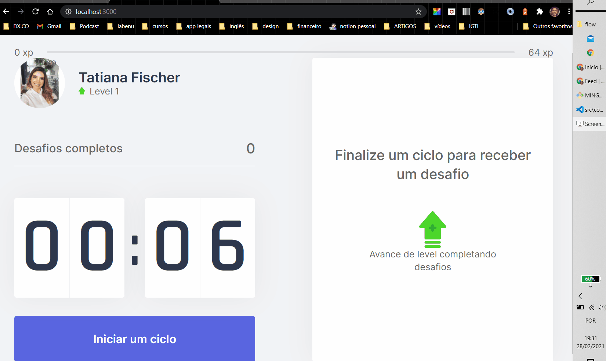
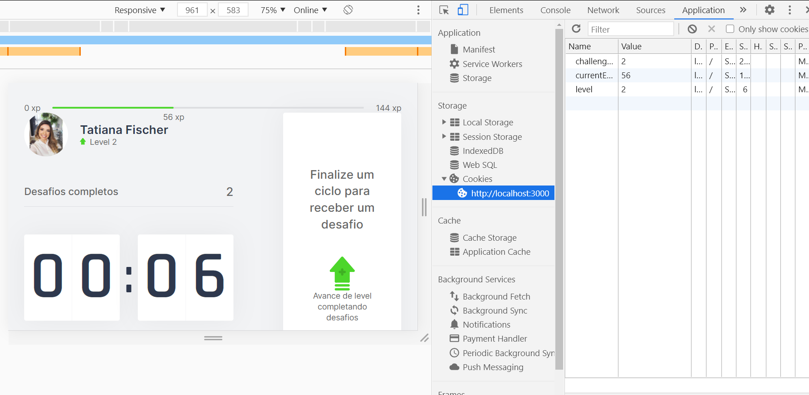

<h1 align="center"> NEXT LEVEL WEEK 4 - Flow App </h1>

##### Front-end project with React.js and Next.js
##### Project developed during the Next Level Week course - [Rocketseat](https://rocketseat.com.br/)
##### Teacher: [Diego Fernandes](https://github.com/diego3g)

<hr/>

### Sumary:
- :rocket: [Description](#rocket-description)
- 👨‍💻️ [Technologies](#%EF%B8%8F-technologies)
- 📦️ [How use](#%EF%B8%8F-how-use)

<hr/>


## :rocket: Description:

How much time do you spend using the computer?
It is already known of the importance for health and productivity to take breaks from work to get around.

The Flow app facilitates time and health management, based on the Pomodoro method.

<strong> At each 25-minute focal cycle, you receive intervals with missions based on meditation, stretching, exercises and eye care. </strong>

For each mission completed, you receive a score for leveling up.

Simple and easy.


---

## 👨‍💻️ Technologies

- [ReactJS](https://reactjs.org/)
- [NextJS]
- [Cookies]
- [Vercel]
- [TypeScript]


### IDE

- [Visual Studio Code](https://code.visualstudio.com/)

---

## 📦️ How use

To copy:

```bash
  # Repository clone:
  ❯ git clone https://github.com/TatianaFischer/Labephoto-Frontend.git

  # Enter the repository:
  ❯ cd flow
```

To install the dependencies and start the project, you can use Yarn ou NPM:

** yarn**

```bash
  # Instalar as dependências
  ❯ yarn

  # Iniciar o projeto
  ❯ yarn dev:server
```

** npm**

```bash
  # Instalar as dependências
  ❯ npm install

  # Iniciar o projeto
  ❯ npm start
```


## 🚀 Deploy
https://flow-one.vercel.app/

<p>
---  
  
  
 
--- 
</p>

<p>
---
 
     

--- 
</p>

<p>
---
  
   
  
--- 
</p>


<h4 align="center">
  Feito por Tatiana Fischer 👋️
 
</h4>
<h4 align="center">
[Linkedin](https://www.linkedin.com/in/tatianaffischer/)
</h4>

